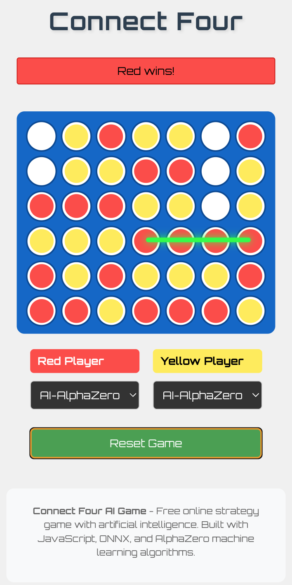

## Connect Four (Web) with AlphaZero AI

<p>
  
</p>

A fully functional Connect Four game built with React/Vite, playable in the browser against another human or a neural-network AI exported to ONNX and run via onnxruntime-web. The final model shipped in `web/public` was trained for a total of 67 hours on a 16-core M4 Max MacBook Pro with 64 MB of RAM and a 40‑core GPU.

### Live demo and links

- Live site: [Play Connect Four](https://eithan.github.io/connect-four/)
- Source repository: [github.com/eithan/connect-four](https://github.com/eithan/connect-four)
- Trained model files for client-side playing (ONNX):
    - [`web/public/alphazero-network-model.onnx`](https://github.com/eithan/connect-four/blob/main/web/public/alphazero-network-model.onnx)
    - [`web/public/alphazero-network-model.onnx.data`](https://github.com/eithan/connect-four/blob/main/web/public/alphazero-network-model.onnx.data)

###

<p>
  
</p>

### Major milestones

1) Initial React/Vite game and rules
- Stand up a Vite + React project with core components (`Board`, `Cell`) and a testable rules engine (`web/src/game/connectFour.js` with unit tests).
- Basic UI/UX for dropping pieces, turn-taking, and a clean board reset.

2) Mobile responsiveness and visual polish
- Iterative CSS work to guarantee a true 7×6 grid with square cells across devices.
- Viewport-based sizing, CSS Grid, and spacing tweaks to prevent overflow and preserve aspect ratios.

3) GitHub Pages CI/CD
- Configure Vite `base` and a deploy workflow to automatically publish the site to GitHub Pages.
- Subsequent fixes while the project layout evolved.

4) Python AlphaZero workspace (`ai/`)
- Add a dedicated training environment: MCTS, network definition, trainer/evaluator, and scripts.
- Produce exportable weights and ONNX artifacts compatible with browser inference.

5) ONNX in the browser
- Integrate `onnxruntime-web` with a dedicated `AI.jsx` helper to load the policy/value network.
- Support external data tensors (`.onnx.data`) and add lazy-loading to keep initial page light.
- Resolve model loading and compatibility issues; reach “AlphaZero working in the browser.”

6) Gameplay and UX refinements
- Winner detection with an animated line across the four-in-a-row; draw (tie) handling.
- Small usability tweaks (fonts, spacing) and basic SEO (manifest, icon, sitemap, robots).

7) Training iterations and model updates
- Multiple training passes and evaluation cycles; publish improved ONNX to `web/public`.
- Best reported checkpoint reached ~87.3% accuracy; continued training led to final shipped model.

8) Repository hygiene
- Remove bulky intermediate artifacts from version control and ignore local `ai` model outputs.
- Keep only the minimal ONNX assets required for the web app in `web/public/`.

### Project structure

- `web/` — The React/Vite app (game, UI, and browser-side AI loader)
- `ai/` — Python AlphaZero training code and scripts (not required to run the website)

### Train the AI and export ONNX

Use the `ai/` workspace to train and export a browser‑ready model.

1) Environment setup

```bash
cd ai
poetry install
```

2) Train (resumable)
NOTE: Increate the epochs and games_per_epoch to get a "smarter" player. Recommended inputs are at least 20,000 games (e.g. >= 100 epochs and 200 games per epoch).

```bash
cd ai
poetry run python -m connect_four_ai.train --action train --verbose --resume --epochs 10 --games_per_epoch 100
```

- Outputs are written to `ai/src/connect_four_ai/models/`:
  - `alphazero-network-weights.pth` (PyTorch weights)
  - `alphazero-network-model-ts.pt` (TorchScript)
  - `alphazero-network-model.onnx` (+ `.onnx.data` if external data is emitted)
  - `alphazero-checkpoint.pt` (for resuming training and accumulating time/configs)
  - `results_summary.txt` (elapsed time, configs, outputs)

3) Copy ONNX artifacts into the web app

```bash
cp ai/src/connect_four_ai/models/alphazero-network-model.onnx web/public/
# If present, also copy the external data tensor file
cp ai/src/connect_four_ai/models/alphazero-network-model.onnx.data web/public/
```

4) Run the web app against your model

```bash
cd web
npm run dev
```

Open the printed local URL; the browser will load `web/public/alphazero-network-model.onnx` (and `.onnx.data` if present) via onnxruntime‑web downloaded from the nearest hosted CDN.


### Build and preview

```bash
cd web
npm run build
npm run preview
```

### Tests

```bash
cd web
npm test
```

### Notes
- The AI runs entirely client-side via WebAssembly. First inference may take longer while the session initializes.
- Training happens offline in `ai/` and is not required to play the web game.


